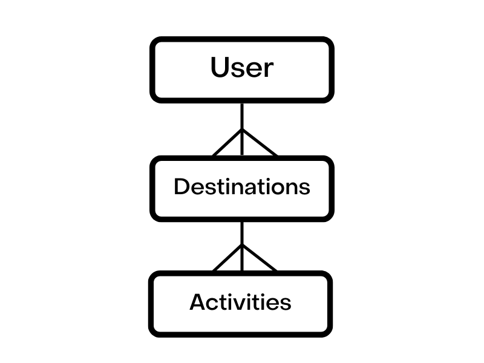

## Travel Planner API

An app that helps you plan and book (stretch goal) trips.

## Structure

Dependencies are stored in [`package.json`](package.json).

The most important file for understanding the structure of the template is
`server.js`. This is where the actual Express `app` object is created, where
the middlewares and routes are registered, and more. To register a routefile,
follow the pattern established here with `exampleRoutes` and `userRoutes`. If
you want to add any middlewares to your app, do that here.

The `app` directory contains models and route files. Models are simply Mongoose
models. To create your own, follow the patterns established in
`app/models/example.js`. Route files are somewhat similar to controllers in
Rails, but they cover more functionality, including serialization and deciding
which HTTP verbs to accept and what to do with them.

The `config` directory holds just `db.js`, which is where you specify the name
and URL of your database.

The `lib` directory is for code that will be used in other places in the
application. The token authentication code is stored in `lib/auth.js`. The
other files in `lib` deal with error handling. `custom_errors.js` is where all
the different custom classes of errors are created. If you need some other kind
of error message, you can add it here. There are also some functions defined
here that are used elsewhere to check for errors. `lib/error_handler.js` is a
function that will be used in all your `.catch`es. It catches errors, and sets
the response status code based on what type of error got thrown.

You probably will only need to interact with files in `app/models`,
`app/routes`, and `server.js`. You'll need to edit `db/config.js` just once,
to change the name of your app.

## API 

https://developers.amadeus.com/

We will be using the Amadeus travel API which connects to flight search, flight booking, hotel and destination content that powers the biggest names in travel.

### Authentication

| Verb   | URI Pattern            | Controller#Action |
|--------|------------------------|-------------------|
| POST   | `/sign-up`             | `users#signup`    |
| POST   | `/sign-in`             | `users#signin`    |
| PATCH  | `/change-password/` | `users#changepw`  |
| DELETE | `/sign-out/`        | `users#signout`   |

### Models

USERS COLLECTION

email: {
    type: String,
    required: true,
    unique: true
}

hashedPassword: {
    type: String, 
    required: true
}

token: String

DESTINATIONS

name: {
    type: String,
    required: true
}

ACTIVITIES 

name: {
    type: String,
    required: true
}

## ERD 

